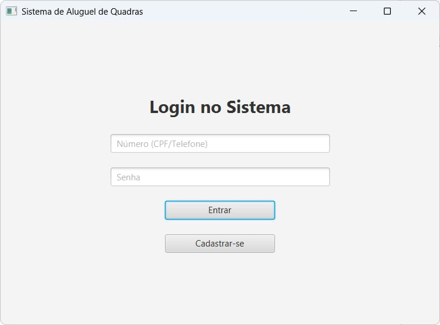
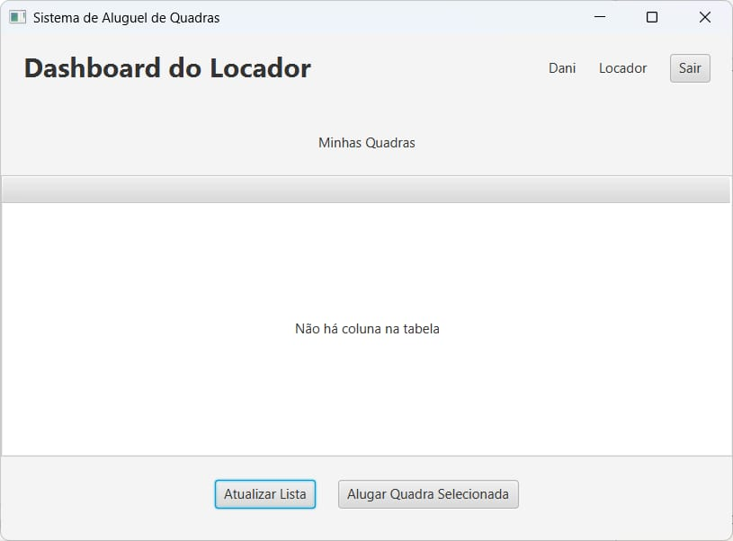
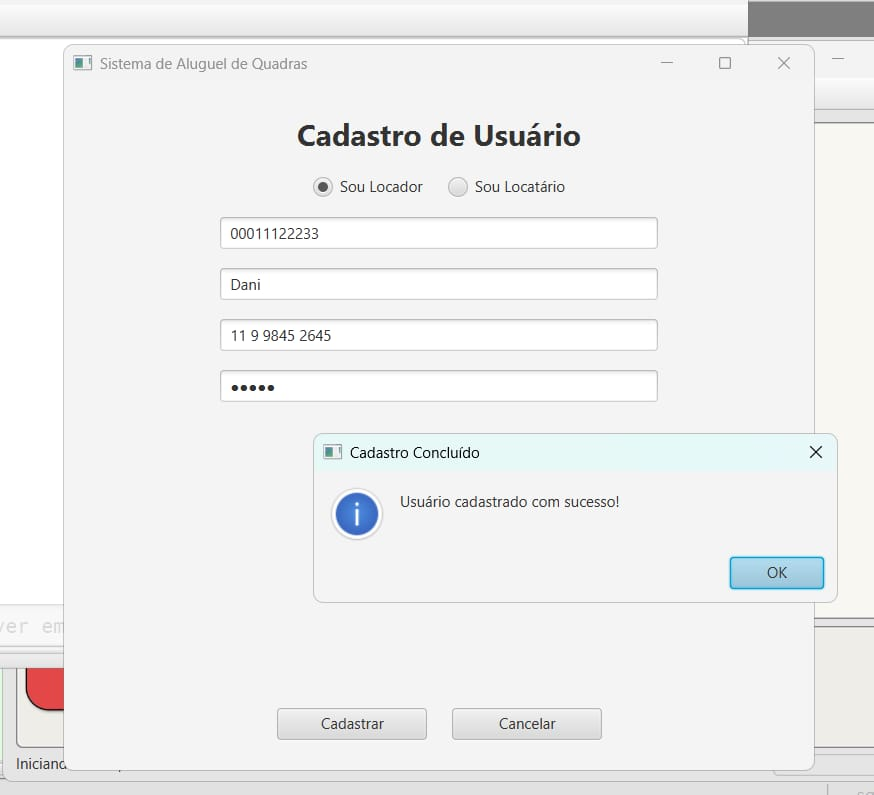
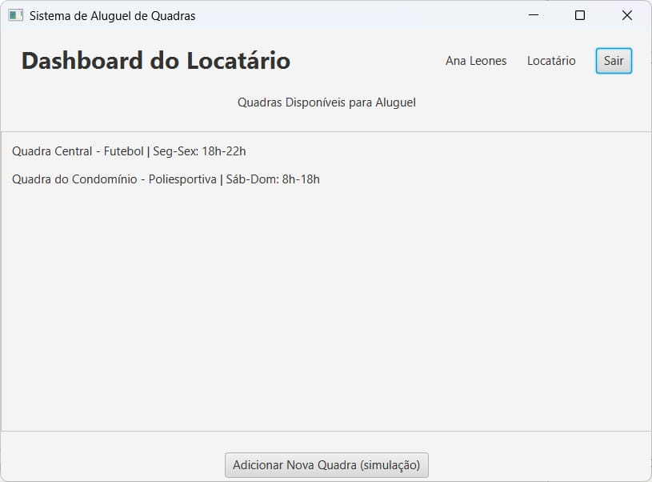
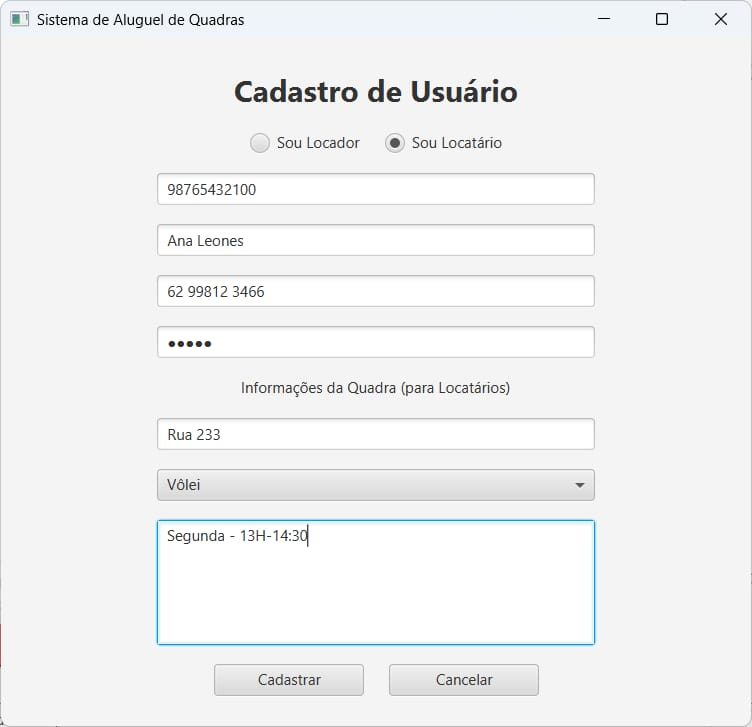
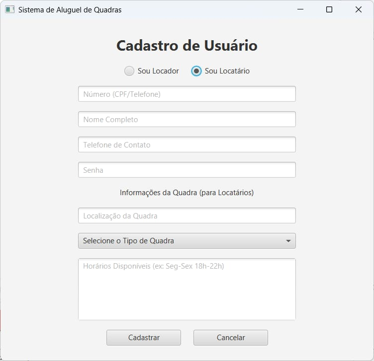
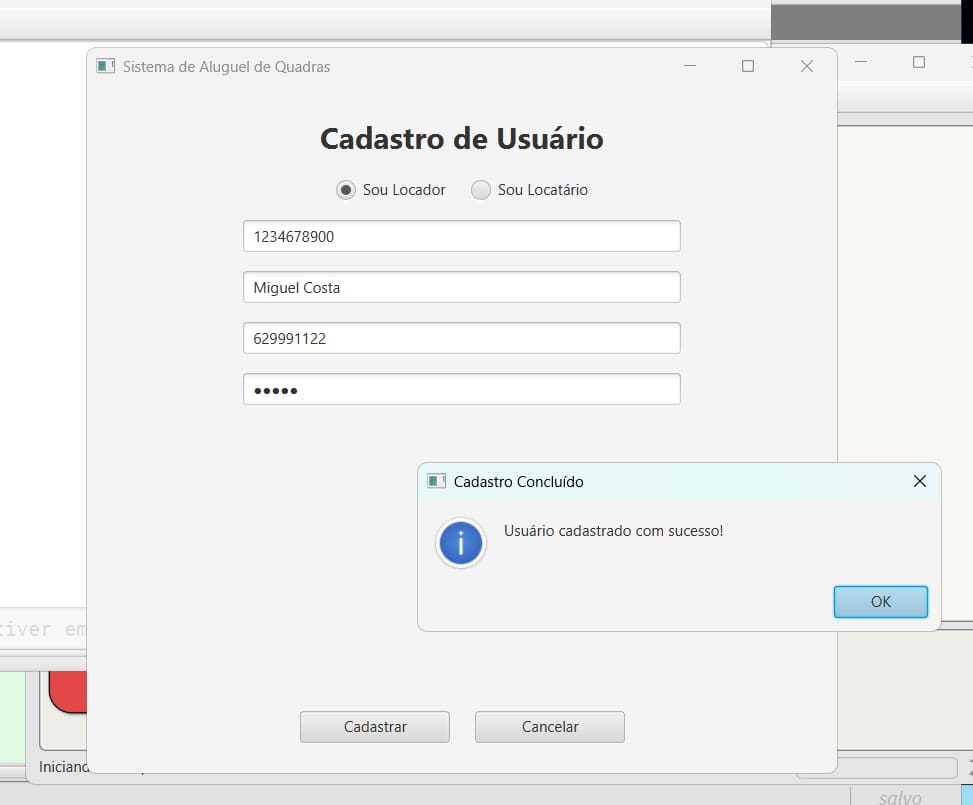

# Sistema de Locação de Quadras

Estudante: Danielly Khalil Cândido Teixeira - [Github](https://github.com/Khalielly)

Estudante: Ana Clara Leones Da Silva - [Github](https://github.com/claraleones)

Estudante: Miguel Carlos Costa Sousa - [Github](https://github.com/miguelccs10)

Este projeto simula um sistema onde dois tipos de usuários interagem com quadras esportivas:

- **Locador**: cadastra quadras para locação.
- **Locatário**: busca quadras disponíveis.

## Estrutura do Projeto

O código segue o padrão MVC (Model-View-Controller), com os arquivos divididos em pacotes:

| Tipo       | Arquivo/Classe           | Função Principal                                             |
|------------|---------------------------|--------------------------------------------------------------|
| **Model**  | `Usuario`, `Locador`, `Locatario` | Representam os tipos de usuários do sistema                  |
|            | `UsuarioRepositorio`      | Acesso e manipulação dos dados dos usuários                  |
|            | `Database`                | Gerencia a conexão com o banco de dados                      |
| **View**   | `Cadastro`, `Login` | Telas de credenciamento                |
|            | `DashboardLocador`             | Formulário para Locador cadastrar uma quadra                 |
|            | `DashboardLocatario`           | Formulário para Locatário buscar quadras                     |
| **Controller** | `CadastroController`    | Lida com o cadastro dos usuários                |
|            | `LoginController`       | Lida com a validação das credenciais do usuário                         |
|            | `DashboardLocatarioController`     | Lida com ações da tela do Locatário                          |
|            | `DashboardLocadorController`     | Lida com ações da tela do Locador                         |
| **Application**   | `Main`                    | Ponto de entrada do programa                                 |

## Funcionamento

1. Ao iniciar, a `Main` abre para fazer o credenciamento do usuário.
2. Com base na escolha do:
   - **Login** é direcionado para um formulário onde pode colocar o CPF/telefone e a senha para entrar.
   - **Cadastro** é direcionado para uma tela onde preenche um formulário para cadastrar no sistemad.

## Como compilar e executar

1. Abra o projeto no BlueJ.
2. Compile todos os arquivos.
3. Clique com o botão direito na classe `Main` e selecione "Executar aplicação JavaFX".

## Resultados

